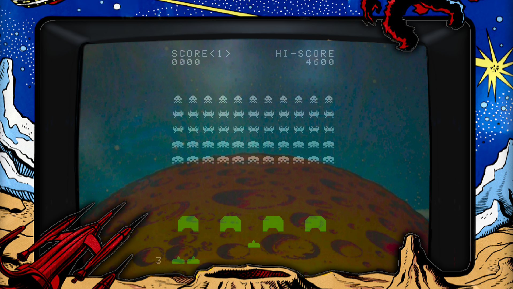

# 👾 Space Invaders



> Uma recriação do clássico de arcade Space Invaders, publicado em 1978 pela empresa Taito

### Conteúdos

- [👾 Features](#-features)
- [🎮 Gameplay](#-gameplay)
- [💻 Pré-requisitos](#-pré-requisitos)
- [🚀 Instalação](#-instalação)
- [☕ Execução](#-instalação)
- [📃 Implementação](#-implementação)


## 👾 Features

O jogo tenta recriar grande parte das mecânicas originais disponíveis na versão de arcade da Taito de 1978, sendo elas:
- [X] Controle do canhão (movimentação horizontal e disparos)
- [X] Movimentação em bloco das naves dos aliens
- [X] Disparos das naves dos aliens (aleatórios, um por coluna no máximo)
- [X] Degradação das barreiras (por tiros do canhão ou das naves)
- [X] Nave mistério, que aparece a cada 15 disparos e com pontuação aleatória
- [X] Pontuações variadas por tipo de alien
- [X] Sistema de vidas (vidas bônus ganhadas quando se atinge certas pontuações)
- [X] Velocidade ascendente conforme naves inimigas são eliminadas
- [X] Dificuldade aumenta conforme se vence partidas

As condições de derrota foram um pouco modificadas, sendo elas:
1. Quando todas as vidas são gastas
2. Quando ao menos uma nave atinge o solo
3. Quando ao menos uma nave colide com o canhão

## 🎮 Gameplay

Os comandos do jogo são simples:
- `Espaço` ou `Z` para disparar
- `Seta para a direita` para movimento para a direita
- `Seta para a esquerda` para movimento para a esquerda
- `Enter` para iniciar uma nova partida e retornar ao menu quando perder
- `Esc`para fechar o jogo 

## 💻 Pré-requisitos

- Compilador `gcc` instalado
- Comando `make` funcional
- Biblioteca `Allegro5` instalada para C
- Comando `git` funcional

## 🚀 Instalação

Para realizar a instalação do projeto, siga as seguintes etapas para seu sistema operacional:

> [!WARNING]
> Caso a instalação falhe, talvez seja necessário alterar as variáveis do Makefile para que sejam compatíveis com seu ambiente.

> [!WARNING]
> O projeto apresentou diversos erros quando portado para Windows e, apesar dos melhores esforços para corrigir, não foi possível fazer o port adequado do jogo. Dessa forma, atualmente, sua instalação e funcionamento se limita ao Linux.


Primeiro, clone o repositório

```bash
git clone https://github.com/victor-arcuri/space-invaders
cd space-invaders
```

Em seguida, rode o makefile para compilar o jogo:
```bash
make
```

Se a instalação foi bem-sucedida, um arquivo executável chamado `Space Invaders` foi criado no diretório! 


## ☕ Execução
Para executar o jogo, inicie o arquivo gerado na instalação:
```
Space Invaders
```

## 📃 Implementação
